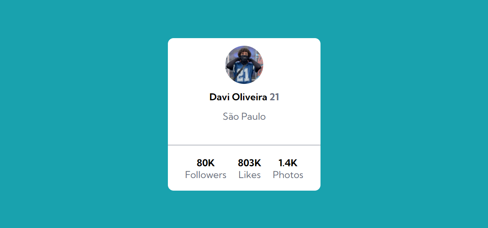
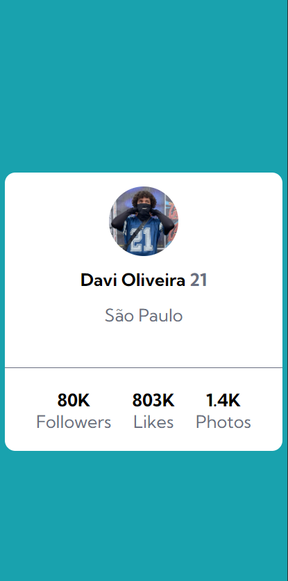

# Cartão de perfil

Esse foi uma exercício realizado no módulo "Exercícios CSS Avançado - Flexbox" do curso Dev Quest - Dev em Dobro 

#### Dificuldades e aprendizados

A única dificuldade que eu tive foi em centralizar o card verticalmente pois não estava utilizando a propriedade "height: 100%;" no main. Fora isso o desenvolvimento foi bem tranquilo.

#### Design Desktop

#### Design Desktop
